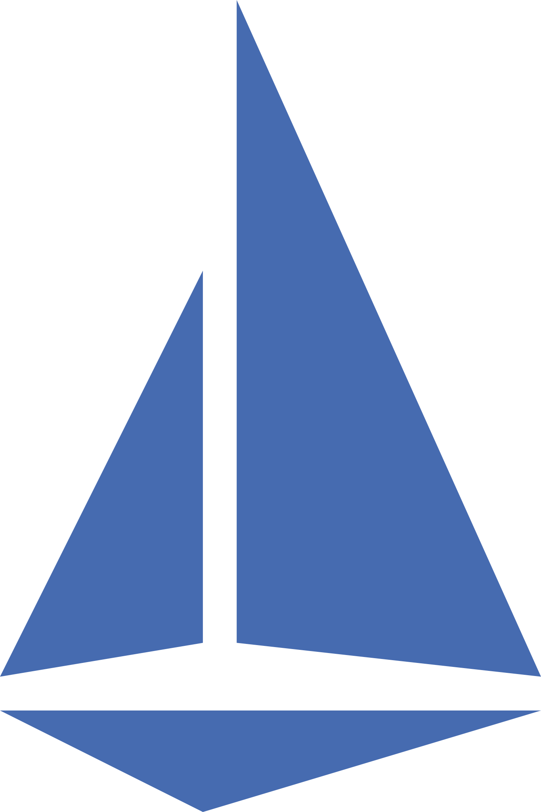

## Cluster Features
  
<table>
    <tr>
        <th>Category</th>
        <th>Feature</th>
        <th></th>
        <th>Tool</th>
        <th>Description</th>
    </tr>
    <tr>
        <td rowspan="3">Cluster Core</td>
        <td>Container Runtime</td>
        <td></td>
        <td><a href="https://containerd.io/">containerd</a></td>
        <td>Image and Container management, CRI tool</td>
    </tr>
    <tr>
        <td>Cluster Initialization</td>
        <td></td>
        <td><a href="https://kubernetes.io/docs/reference/setup-tools/kubeadm/">Kubeadm</a></td>
        <td>Kubernetes cluster setup, initialization and node joining</td>
    </tr>
    <tr>
        <td>Container Network Interface</td>
        <td></td>
        <td><a href="https://github.com/flannel-io/flannel">Flannel</a></td>
        <td>Pod network add-on, enables cluster DNS</td>
    </tr>
    <tr>
        <td rowspan="4">Deployment Automation</td>
        <td>CI</td>
        <td></td>
        <td><a href=https://github.com/features/actions>Github Actions</a></td>
        <td>Continuous Integration - unpacked and packed testing</td>
    </tr>
    <tr>
        <td>CD</td>
        <td></td>
        <td><a href="https://argoproj.github.io/cd">ArgoCD + Rollouts</a></td>
        <td>Continuous Delivery and Deployment - Git synchronised with cluster environments. Canary rollouts</td>
    </tr>
    <tr>
        <td>Infrastructure Provisioning</td>
        <td></td>
        <td><a href="https://www.crossplane.io/">Crossplane</a></td>
        <td>For CRDs and linked with Azure provider to manage out-of-cluster cloud resources</td>
    </tr>
    <tr>
        <td>Release Management</td>
        <td></td>
        <td><a href="https://helm.sh/">Helm</a></td>
        <td>Package management - app versioning, repositories and dependencies</td>
    </tr>
    <tr>
        <td rowspan="2">Storage</td>
        <td>Storage Operator</td>
        <td></td>
        <td><a href="https://rook.io/">Rook</a></td>
        <td>Cloud native storage orchestrator - link with distributed storage solution</td>
    </tr>
    <tr>
        <td>Disaster Recovery, Migration</td>
        <td></td>
        <td><a href="https://velero.io/">Velero</a></td>
        <td>Data backups, migration and disaster recovery for cluster resources and PVs</td>
    </tr>
    <tr>
        <td rowspan="2">Networking</td>
        <td>Service Mesh</td>
        <td></td>
        <td><a href="https://istio.io/">Istio</a></td>
        <td>Cluster networking management and observability</td>
    </tr>
    <tr>
        <td>Health and Topology</td>
        <td></td>
        <td><a href="https://kiali.io/">Kiali</a></td>
        <td>Istio add on to monitor service communication and availability</td>
    </tr>
    <tr>
        <td rowspan="3">Security</td>
        <td>Runtime Security</td>
        <td></td>
        <td><a href="https://falco.org/">Falco</a></td>
        <td>Custom behavioral rules and alerts for cluster anomalies</td>
    </tr>
    <tr>
        <td>Vulnerability Scanning</td>
        <td></td>
        <td><a href="https://github.com/aquasecurity/trivy-operator">trivy-operator + kube-hunter</a></td>
        <td>Dynamic security tests (passive and active). Audit reports </td>
    </tr>
    <tr>
        <td>Secrets Management</td>
        <td></td>
        <td><a href="https://www.vaultproject.io/">Vault</a></td>
        <td>Hashicorp Vault cluster for all project secrets, connection established with Github Actions environment secrets</td>
    </tr>
    <tr>
        <td rowspan="2">Policy Enforcement</td>
        <td>Policy Engine</td>
        <td></td>
        <td><a href="https://www.openpolicyagent.org/">Open Policy Agent</a></td>
        <td>Policy-based control - manages and evaluates policies against incoming requests and configuration changes</td>
    </tr>
    <tr>
        <td>Manifest Validation</td>
        <td></td>
        <td><a href="https://www.datree.io/">Datree</a></td>
        <td>Scans configs to prevent misconfigured resources reaching cluster</td>
    </tr>
    <tr>
        <td rowspan="4">Observability</td>
        <td>Monitoring</td>
        <td></td>
        <td><a href="https://artifacthub.io/packages/helm/prometheus-community/kube-prometheus-stack">kube-prometheus-stack</a></td>
        <td>Monitoring, alerting and visualisation stack including Prometheus, Alert Manager and Grafana</td>
    </tr>
    <tr>
        <td>Logging</td>
        <td></td>
        <td><a href="https://www.elastic.co/guide/en/cloud-on-k8s/2.8/k8s-quickstart.html">ECK</a></td>
        <td>Log management and delivery with Elastic Cloud on Kubernetes. Beats -> ElasticSearch -> Kibana</td>
    </tr>
    <tr>
        <td>APM</td>
        <td></td>
        <td><a href="https://www.elastic.co/guide/en/cloud-on-k8s/2.8/k8s-apm-server.html">Elastic APM Server</a></td>
        <td>Application Performance Monitoring - integrated with ECK service</td>
    </tr>
    <tr>
        <td>Troubleshooting</td>
        <td></td>
        <td><a href="https://komodor.com/">Komodor</a></td>
        <td>Cluster troubleshooting platform - health monitoring and automated root cause detection</td>
    </tr>
    <!-- Add more rows for other tools -->
</table>
 